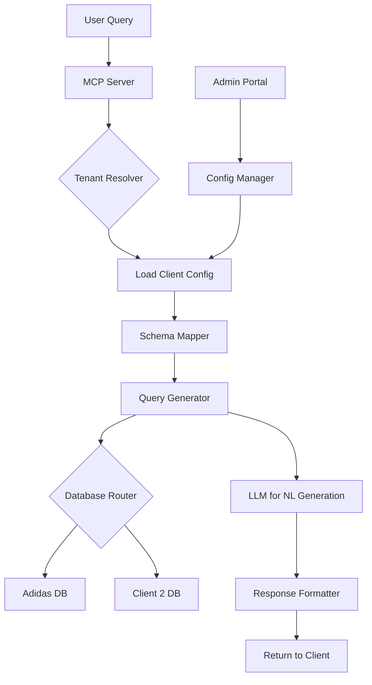

# Multi-Tenant Conversational BI Agent Architecture

## Core Approach: Plugin-Based Multi-Tenant System

The key is **separating the core agent logic from client-specific configurations**. Here's the optimal architecture:

### Architecture Components

1. **Core MCP Server** (client-agnostic)
   - Query understanding & generation
   - Conversation management
   - Security & authentication
   - MCP protocol implementation

2. **Client Configuration Layer**
   - Database schemas & connection strings
   - Business logic & KPIs
   - Brand-specific prompts
   - Access control rules

3. **Data Abstraction Layer**
   - Unified query interface
   - Multi-database support
   - Schema mapping

### Implementation Strategy

#### Option A: Configuration-Driven (Recommended)

```text
client_configs/
├── adidas/
│   ├── schema.yaml
│   ├── metrics.yaml
│   └── prompts.yaml
├── nike/
│   └── ...
└── common/
    └── base_config.yaml
```

#### Option B: Plugin Architecture

- Each client as a Python/TypeScript module
- Hot-swappable without redeployment
- Inheritance from base client class

### Workflow Diagram



## Technical Stack

### Core Technologies

- **MCP Framework**: Model Context Protocol SDK
- **Agent Framework**: LangGraph or CrewAI (for complex workflows)
- **LLM**: Claude 3.5 Sonnet via Anthropic API
- **Database**:
  - PostgreSQL (primary data warehouse)
  - DuckDB (for analytical queries)
  - Support for BigQuery, Snowflake connectors

### Key Tools

1. **Text-to-SQL**:
   - SQLCoder or CodeLlama for SQL generation
   - Vanna.AI for schema-aware queries

2. **Semantic Layer**:
   - dbt for metric definitions
   - Cube.js for unified data model

3. **Configuration Management**:
   - Pydantic for config validation
   - YAML/JSON for client configs

4. **Authentication**:
   - JWT tokens with tenant claims
   - OAuth 2.0 for client authentication

5. **Observability**:
   - LangSmith for agent tracing
   - Prometheus + Grafana for metrics

## Multi-Tenant Isolation Strategies

1. **Database Level**: Separate schemas per client
2. **Row-Level Security**: tenant_id column filtering
3. **API Level**: Tenant authentication in MCP tools

## Sample MCP Tool Structure

```python
@mcp.tool()
async def query_sales_data(
    tenant_id: str,
    question: str,
    date_range: Optional[str]
) -> Dict:
    # Load tenant config
    config = load_client_config(tenant_id)

    # Generate SQL with tenant schema
    sql = generate_sql(question, config.schema)

    # Execute with tenant DB connection
    results = execute_query(sql, config.db_connection)

    # Format with tenant branding
    return format_response(results, config.formatting)
```

## Deployment Workflow

1. **Development**: Local MCP server with test configs
2. **Onboarding New Client**:
   - Create client config file
   - Map database schema
   - Define custom metrics
   - Test queries
3. **Deployment**: Single MCP server instance serves all clients
4. **Scaling**: Kubernetes with client-based routing

## Key Differentiators for Production

- **Schema Evolution**: Version control for client configs
- **Query Caching**: Redis for frequently asked questions
- **Fallback Handling**: Graceful degradation when SQL generation fails
- **Audit Logging**: All queries logged per tenant
- **Cost Management**: Token usage tracking per client

This architecture allows you to deploy once and scale to hundreds of clients with minimal code changes—just configuration updates.
